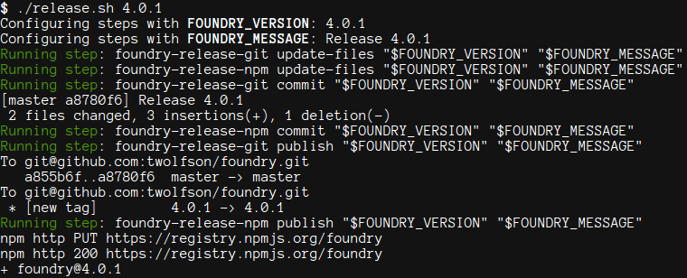

# foundry [](https://travis-ci.org/twolfson/foundry) [](https://ci.appveyor.com/project/twolfson/foundry/branch/master)

Release manager for [npm][], [bower][], [component][], [PyPI][], [git tags][], and any command you want.

[npm]: http://npmjs.org/
[bower]: http://bower.io/
[component]: http://component.io/
[PyPI]: http://pypi.python.org/
[git tags]: http://git-scm.com/

This was created out of frustration; there was no generic *sharable* release manager.

**Features:**

- Well tested release library with well tested commands
- Specification is CLI based, allowing for any language implementation
    - https://github.com/twolfson/foundry-release-spec
- Transparent output; always know what commands are being executed
- Cross platform support (GNU/Linux, OS X, Windows)
- Resumable releases via `foundry resume`
    - Allows for human and machine error (e.g. forget to log in, repository is being flaky)
- [Newsletter][], subscribe to hear about new features and releases
    - http://eepurl.com/bCWbGj

[Newsletter]: http://eepurl.com/bCWbGj



## Getting Started
Install the module via: `npm install foundry`

By default, `foundry` is not configured with any release commands. Install a release command via `npm`:

```bash
npm install foundry-release-bower  # bower
npm install foundry-release-component  # component.io
npm install foundry-release-git  # git
npm install foundry-release-npm  # npm
npm install foundry-release-pypi  # PyPI
```

Details about existing commands and their documentation can be found under the [Commands](#commands) heading.

For example purposes, we will create/release on a local-only `git` repository.

```bash
# Create git repo
mkdir foundry-example
cd foundry-example
git init
echo "Hello World" > README.md
git add README.md
git commit -m "Added documentation"

# Generate `package.json` with `foundry` config
cat > package.json <<EOF
{
  "foundry": {
    "releaseCommands": [
      "foundry-release-git"
    ]
  }
}
EOF

# Install corresponding `git` foundry-release command
npm install foundry-release-git

# Run our release (links repeated at bottom of example)
#   Prepending `./node_modules/.bin/` to `PATH` can be avoided by using `foundry.cli`
#   https://github.com/twolfson/foundry.cli
#   or by using `npm-run-script`
#   https://www.npmjs.org/doc/misc/npm-scripts.html#environment
PATH="$PATH:$PWD/node_modules/.bin/"
foundry release 1.0.0
# Configuring steps with FOUNDRY_VERSION: 1.0.0
# Configuring steps with FOUNDRY_MESSAGE: Release 1.0.0
# Running step: foundry-release-git update-files "$FOUNDRY_VERSION" "$FOUNDRY_MESSAGE"
# Running step: foundry-release-git commit "$FOUNDRY_VERSION" "$FOUNDRY_MESSAGE"
# [master ec7a32d] Release 1.0.0
# Running step: foundry-release-git register "$FOUNDRY_VERSION" "$FOUNDRY_MESSAGE"
# Running step: foundry-release-git publish "$FOUNDRY_VERSION" "$FOUNDRY_MESSAGE"
# Pushes to remote server

# See the release commit and tag
git log --decorate --oneline
# c6ce921 (HEAD, tag: 1.0.0, master) Release 1.0.0
# f0c25b3 Added documentation
```

Links to alternatives to extending `PATH`:

- `foundry.cli`, global CLI bindings for `foundry`
    - https://github.com/twolfson/foundry.cli
- `npm-run-script`, run scripts from within `npm's` context
    - https://www.npmjs.org/doc/misc/npm-scripts.html#environment

## Documentation
### Release process
When a release occurs, the following steps are processed:

1. Update files, update package files with the new version and changes (e.g. update `package.json`, add to `CHANGELOG.md`)
2. Commit, persist any changes to a version control system (e.g. `git commit && git tag`)
3. Register, if the package is new (semver === `1.0.0`), then register it to its repository (e.g. `python setup.py register`)
    - We can customize this semver via the `registerVersion` configuration
4. Publish, release changes to package's repository (e.g. `npm publish`)

### Configuration
`foundry` can be configured via a JSON `.foundryrc` file or under a `foundry` key in a `package.json`. In both cases, we expect the JSON to be the same.

- registerVersion `String` - Semver to identify a new package by (e.g. `0.1.0`, `1.0.0`)
    - When the `release` semver matches this, we will run `register` steps. Otherwise, we won't.
    - By default, `registerVersion` is `1.0.0`
        - We have chosen this to avoid the confusion of allowing "minor" releases in `0.x.y` that introduce breaking changes
- releaseCommands `Array` - Collection of commands to use when releasing
    - * `String|Object` - Information about command to run when releasing
        - A string is shorthand for `{type: releaseCommand, command: {{string}}}`
        - Objects have a required `type` property that changes their behavior
            - type `String` - Classification of command
                - This can be `releaseCommand` or `customCommand`

**releaseCommand** is a CLI command that lines up with [foundry-release-spec][]

- type `String` - Classification of command
- command `String` - Name of command to use
    - During `release`, we will each of the release steps (e.g.  `{{command}} update-files FOUNDRY_VERSION FOUNDRY_MESSAGE`)
    - For example, this would be `foundry-release-git update-files 1.0.0 "Release 1.0.0"`

```js
{
  "type": "releaseCommand",
  "command": "foundry-release-git"
}
```

[foundry-release-spec]: https://github.com/twolfson/foundry-release-spec

**customCommand** is a command with a custom setup

- type `String` - Classification of command
- updateFiles `String` - Script to run when updating files
    - This will be invoked via `sh` or `cmd` depending on our OS
    - We provide `FOUNDRY_VERSION` and `FOUNDRY_MESSAGE` via environment variables
    - An example command is `echo "$FOUNDRY_VERSION: $FOUNDRY_MESSAGE" >> CHANGELOG.md`
        - This is converted into `echo "1.0.0: Release 1.0.0" >> CHANGELOG.md` via `sh`
    - A more practical command would be `npm run build` to compile pre-release assets
- commit `String` - Script to run when committing changes to files
    - This is invoked in the same fashion as `updateFiles` with `sh/cmd` and environment variables
- register `String` - Script to run when registering a package
    - This is only runs if registration requisite is met
    - This is invoked in the same fashion as `updateFiles` with `sh/cmd` and environment variables
- publish `String` - Script to run when publishing a package
    - This is invoked in the same fashion as `updateFiles` with `sh/cmd` and environment variables

```js
{
  "type": "customCommand",
  "updateFiles": "echo \"$FOUNDRY_VERSION\" > VERSION.txt"
}
```

**Example config with all variations:**

```js
// This is for a `.foundryrc`
// In a `package.json`, we would be nested inside of the `foundry` key
{
  "releaseCommands": [
    "foundry-release-git", // Shorthand
    {
      "type": "releaseCommand",
      "command": "foundry-release-npm"
    },
    {
      "type": "customCommand",
      "updateFiles": "echo \"$FOUNDRY_VERSION\" > VERSION.txt"
    }
  ]
}
```


### CLI
`foundry` provides a command line interface for releasing.

```bash
$ foundry --help

  Usage: foundry [options] [command]

  Commands:

    release [options] <version> Update package metadata and publish to registries
    resume [options]       Resume an incomplete release
    commands               List commands used by current package
    completion             Get potential completions for a command. Looks for `COMP_CWORD`, `COMP_LINE`, `COMP_POINT`.

  Options:

    -h, --help     output usage information
    -V, --version  output the version number

```

Example releases are:

```bash
foundry release 1.0.0
foundry release 1.1.0
foundry release 2.0.0
```

> Commands that automatically increment semver are planned (e.g. `foundry release major`, `foundry release minor`). See https://github.com/twolfson/foundry/issues/16 for more information.

### Commands
`foundry` release commands contain the `foundry-release` keyword and adhered to the `foundry` release command specification:

https://github.com/twolfson/foundry-release-spec

Existing commands are:

- [foundry-release-bower][], manages `version` in `bower.json`
- [foundry-release-component][], manages `version` in `component.json`
- [foundry-release-git][], runs `git tag` and `git commit` upon release
- [foundry-release-npm][], manages `version` in `package.json` and runs `npm publish` upon release
- [foundry-release-pypi][], manages `version` in `setup.py` and registers/zips/gzips package upon release
- More commands can be found at https://www.npmjs.org/browse/keyword/foundry-release

[foundry-release-bower]: https://github.com/twolfson/foundry-release-bower
[foundry-release-component]: https://github.com/twolfson/foundry-release-component
[foundry-release-git]: https://github.com/twolfson/foundry-release-git
[foundry-release-npm]: https://github.com/twolfson/foundry-release-npm
[foundry-release-pypi]: https://github.com/twolfson/foundry-release-pypi

## Contributing
In lieu of a formal styleguide, take care to maintain the existing coding style. Add unit tests for any new or changed functionality. Lint via `npm run lint` and test via `npm test`.

## Donating
Support this project and [others by twolfson][twolfson-projects] via [donations][twolfson-support-me].

<http://twolfson.com/support-me>

[twolfson-projects]: http://twolfson.com/projects
[twolfson-support-me]: http://twolfson.com/support-me

## Unlicense
As of Dec 07 2013, Todd Wolfson has released this repository and its contents to the public domain.

It has been released under the [UNLICENSE][].

[UNLICENSE]: UNLICENSE
